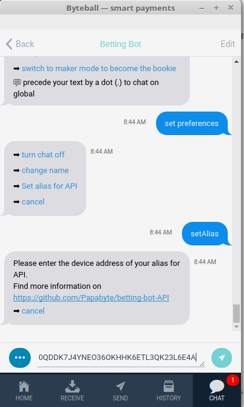

# betting-bot-API

This is a documentation and samples of code to get you started with the Byteball [Betting Bot](https://papabyte.com/byteball-sport-betting-bot.html) API.

## Introduction

The API allows makers to automatize the management of their bet offers. Communication with the betting bot being made through the integrated private messaging, this sample of code requires a headless wallet module.
Your headless wallet won't handle bytes but will only send [JSON commands](COMMANDS.md) to place, edit or remove your odds offers.
It works in parallel with your wallet GUI chat that you use to deposit or withdraw bytes and proceed with any usual operations.

## Get started

- [Install nodeJS](https://www.digitalocean.com/community/tutorials/how-to-install-node-js-on-debian-8)
- apt-get install git
- git clone https://github.com/Papabyte/betting-bot-API.git
- npm install
- node api.js

At first start you will be asked to enter a device name and a passphase.
Although the headless wallet doesn't handle money, an attacker taking control could exploit it by setting odds at his advantage, so better protect it with a decent passphrase.

It should give you a device address as below:
```
====== my device address: 0QDDK7J4YNEO36OKHHK6ETL3QK23L6E4A
```

Copy it, open a chat with the betting bot, go set preferences -> set alias for API and enter your headless wallet device address.



Your headless wallet is now allowed to manage your odds and the betting-bot will respond with a JSON message to any request made by it.

You can build you odds management application using the sendRequest function present in api.js:
```
sendRequest("getFeedNames", {championship: "NHL"}, {
	ifSuccess: function(feedNames) {
		process.stdout.write("\nCurrent feed names: " + JSON.stringify(feedNames))
	},
	ifFailed: function(error) {
		process.stdout.write("\nFailed to get feed names. Reason:" + error);
	}
});
```

The first parameter is the [command](COMMANDS.md)

The second parameter is an object containing parameters (set as null if irrelevant)

The third parameter is an object containing two function as property, ifSuccess is the function that will be executed if a successfull response is made by the bot (the response is passed as parameter), ifFailed is the function that will be executed if the bot returned an error (the error is passed as parameter).

If a request fails, one of these errors is returned:

```
	1: "Invalid JSON",
	2: "Message must be a JSON array",
	3: "Array must be 2 elements array",
	4: "Type of message must be request",
	5: "Second element of array must be an object",
	6: "No tag in command",
	7: "Invalid tag",
	8: "No time limit specified",
	9: "Time limit must be an unix timestamp in seconds",
	10: "Timeout for command expired",
	11: "No command found in request",
	12: "Command must be a string",
	13: "cat parameter must be a string",
	14: "championship parameter must be a string",
	15: "Unknown command",
	16: "This command must have parameters",
	17: "Odds must be a number",
	18: "A feedname must be specified",
	19: "Feedname must be a string",
	20: "Feedname not in calendar",
	21: "Amount max must be specified",
	22: "Amount max must be a number",
	23: "Implied probability must be over 100%",
	24: "Minimum amount is 100MB",
	25: "Odds must be a number > 1 or 0",
	26: "No such offer found"

```